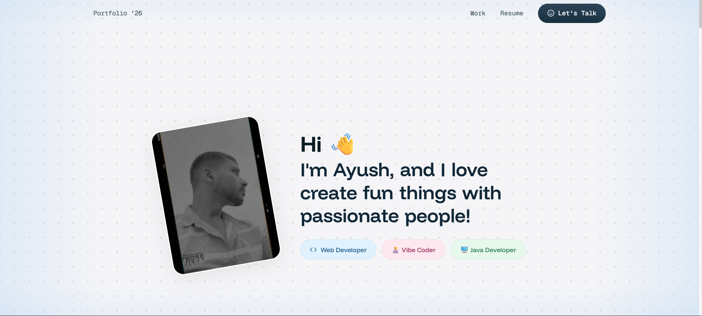

# Ayush Srivastava | Developer Portfolio '26

A modern, premium, and interactive web developer portfolio built without heavy frontend frameworks. It leverages raw HTML, CSS, JavaScript, GSAP for high-end animations, and Lenis for silky-smooth scroll experiences. 

 *(Preview image)*

## 🚀 Live Demo
[Ayush Portfolio](https://ayush-jack.github.io/Ayush-Portfolio/)

## ✨ Features

- **Framer-Quality Animations:** Staggered letter-by-letter text reveals, 3D image tilts, and smooth fade-ins engineered with GSAP.
- **Lenis Smooth Scroll:** Buttery-smooth, momentum-based scrolling that works flawlessly across devices.
- **Magnetic Buttons:** Interactive buttons and social icons that pull naturally toward the cursor.
- **Mouse Parallax Effect:** Hero image responds dynamically to cursor movements with a subtle 3D rotate effect.
- **Interactive Dot Grid:** A responsive canvas dot grid background that reacts to cursor proximity (gravity pull effect).
- **Responsive Design:** Carefully crafted layouts for Desktop and Mobile (including custom mobile backgrounds and centered typography).
- **Optimized Assets:** Lightning-fast load times with highly compressed images (up to 99% size reduction) and lazy-loaded components.
- **Anti-Scraping Protection:** Disabled right-click, F12 inspector, and source-code shortcuts to protect custom UI assets.

## 🛠️ Technology Stack

- **HTML5** (Semantic structure)
- **Vanilla CSS3** (Custom variables, flexbox/grid architecture, media queries)
- **Vanilla JavaScript** (ES6+)
- **[GSAP 3](https://greensock.com/gsap/)** included via CDN (Core animations + ScrollTrigger)
- **[Lenis](https://lenis.darkroom.engineering/)** included via CDN (Scroll smoothing)

## 📁 Project Structure

```text
/
├── index.html        # Main portfolio layout structure
├── style.css         # Global styles, variables, layout, responsive design
├── script.js         # GSAP timelines, Lenis setup, cursor physics, canvas logic
├── resume.pdf        # Downloadable resume
└── images/           # Heavily optimized images (WebP/JPG/SVG)
    ├── about*.jpg    
    ├── project*.png  
    ├── profile.jpg
    └── mobile-bg.svg # Custom mobile background pattern
```

## ⚙️ Local Setup

Since this is a static build without NPM dependencies, you can run it instantly using any local server.

1. **Clone the repository:**
   ```bash
   git clone https://github.com/Ayush-Jack/Ayush-Jack.github.io.git
   ```
2. **Navigate into the directory:**
   ```bash
   cd Ayush-Jack.github.io
   ```
3. **Run a local server:**
   *(If you have Node.js installed)*
   ```bash
   npx http-server -p 8080
   ```
   *Alternatively, use the VS Code "Live Server" extension.*
4. **View in browser:**
   Open `http://localhost:8080`

## 🎨 Design Philosophy

The aesthetic combines "Vibe Coding" with clean typography (`Funnel Display` font) and subtle interaction micro-animations. It aims to deliver the premium feel of an agency website (like Framer or Webflow templates) while remaining lightweight and handwritten. 

---
*Built with ♥ by [Ayush Srivastava](https://github.com/Ayush-Jack)*
